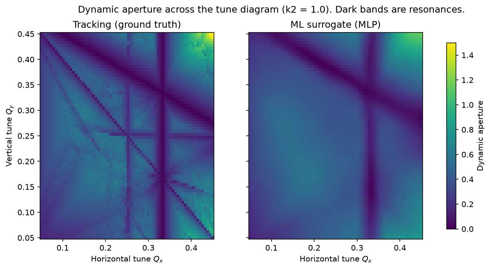
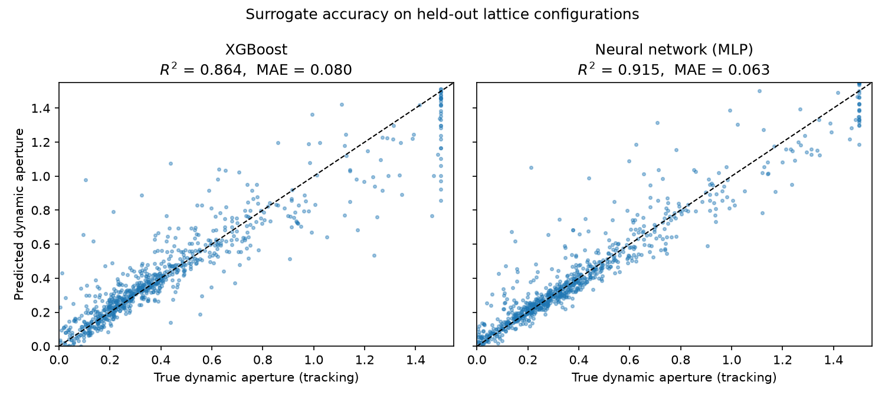

# Dynamic aperture surrogate

Training a model to predict a storage ring's dynamic aperture (DA) instead
of computing it by tracking particles turn by turn. Once trained, it's on
the order of 50,000x faster than the tracking it replaces (exact number
varies a bit run to run depending on system load - I got ~52,700x here,
~70,000x on an earlier run). R² = 0.92 on configurations it never saw
during training.



## Background

DA is the largest amplitude a particle can have and still stay in the
ring long-term - go past it and nonlinear effects (mostly from
sextupoles, in this case) eventually kick it out. It's one of the things
you check when designing a lattice, and it's annoying to compute because
there's no closed-form answer - you have to actually track particles for
hundreds or thousands of turns and see who survives.

During my PhD I did a lot of exactly this: tracking ~10^5 particles over
7x10^5 turns for an EDM storage-ring lattice (RWTH Aachen / FZ Jülich /
CERN). This project is a smaller, self-contained version of the same
question - can a model learn to predict DA directly from lattice
parameters and skip the tracking step entirely?

## Why a toy model instead of my thesis code

Two reasons. The actual PhD simulation code and data isn't mine to just
publish - it belongs to the collaboration. And I wanted something anyone
could clone and run in under a minute without installing MAD-X or Bmad.
So instead I used the 4D Hénon map, which is the standard minimal model
for this kind of nonlinear beam dynamics: a linear rotation (the
"lattice") plus one sextupole kick (the nonlinearity). Same qualitative
physics, same kind of resonance structure, a lot less code.

## The model

One turn = rotate by the tune, then kick:

```
px -> px + k2*(x^2 - y^2)
py -> py - 2*k2*x*y
```

(those two terms are just Re and Im of k2*(x+iy)^2 - standard sextupole
multipole expansion, not something I invented)

DA is found by bisection: pick a launch amplitude, track it for 1000
turns, see if it survives. If yes, search further out; if no, search
closer in. 12 bisection steps per angle, minimum over 5 angles (DA isn't
the same in every direction, so you take the worst case).

## Results

| Model | R² (test) | MAE | Inference / config |
|---|---|---|---|
| XGBoost | 0.86 | 0.081 | ~14 µs |
| MLP (128-128-64) | **0.92** | **0.063** | ~14 µs |
| Tracking (baseline) | - | - | ~0.7 s |

The MLP edged out XGBoost here - my guess is the DA surface is mostly
smooth away from the resonances, and a network with continuous
activations just represents that kind of smooth curve more naturally
than a tree ensemble, which approximates things in axis-aligned steps.
Not 100% sure that generalizes beyond this specific setup though.



Looking at the map above - left is the real tracked DA, right is what
the surrogate predicts. The big resonance bands (the diagonal Qx=Qy one,
the Qx=1/3 line) come through fine. The thinner resonance lines mostly
get smoothed away, which makes sense - 4000 random samples just isn't
enough to pin down narrow features like that.

## Repo layout

```
beamsim/henon.py       # the tracker + DA search
generate_dataset.py    # samples lattice configs, builds the training set
train.py               # trains XGBoost + MLP, benchmarks the speedup
make_plots.py          # the two figures above
```

## Running it

```bash
pip install -r requirements.txt
python generate_dataset.py   # ~10s, 4000 configs
python train.py
python make_plots.py
```

Everything's seeded so you should get the same numbers I got.

## Stuff I'd improve

- 4000 random samples clearly isn't enough to resolve the narrow
  resonances - active/adaptive sampling near steep DA gradients would
  help without needing that much more tracking time
- some DA values in the dataset are exactly 1.5 (= r_max) - that just
  means bisection ran out of search range, not that 1.5 is the real
  answer. Should flag those separately or just raise r_max.
- obviously the real test is running this same pipeline on DA output
  from an actual lattice code (MAD-X, Bmad) instead of the Hénon toy
  model - that's the natural next step if I keep working on this

## Me

Saad Siddique - PhD candidate in accelerator physics, RWTH Aachen.
Thesis on beam dynamics simulations for an EDM storage ring, done in
collaboration with FZ Jülich, GSI, and CERN.
